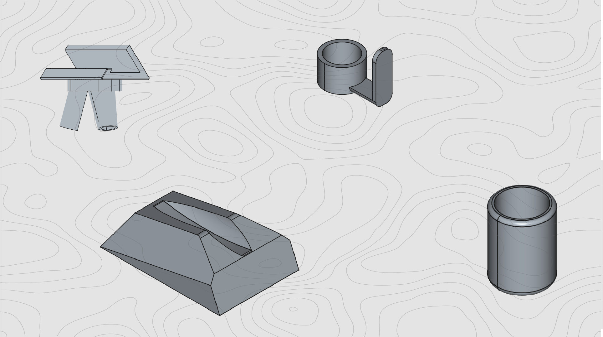
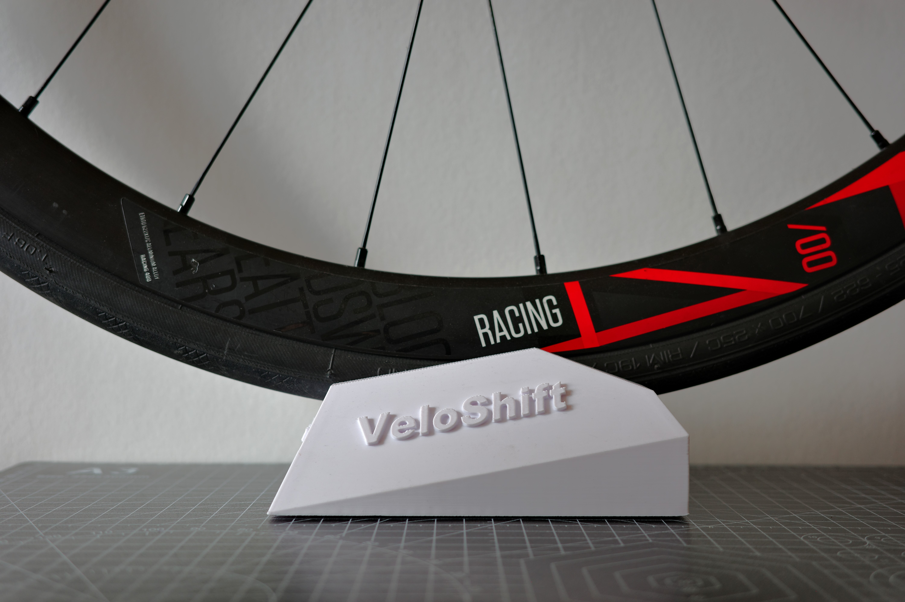
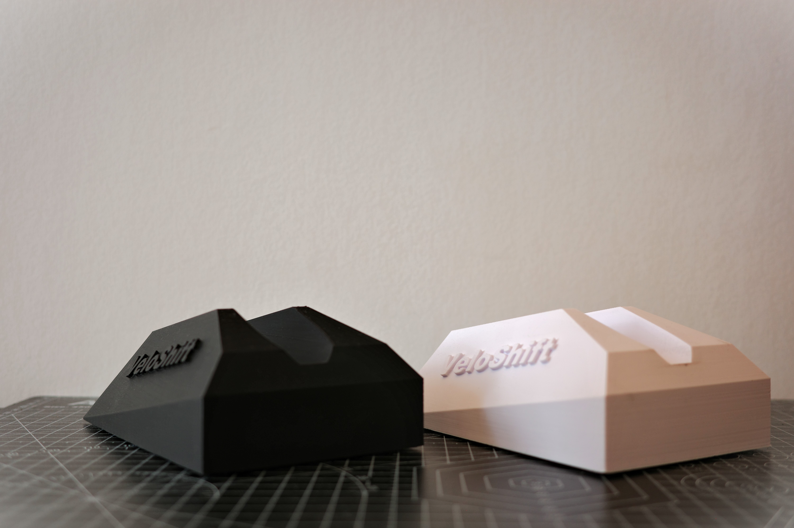

# VeloShift — 3D Printable Cycling Accessories

## The Story

VeloShift was a small passion project born out of a love for indoor cycling and 3D printing. The original idea was to build a brand around beautifully designed, 3D-printed topographic route maps of iconic [Zwift](https://www.zwift.com/) courses — the kind of thing you'd frame and hang in your pain cave.

Alongside the maps, a small lineup of practical 3D-printed accessories for indoor cycling setups was designed: wheel blocks, tablet stands, AirTag holders, and more.

Everything was designed, prototyped, photographed, and ready to go. But then Zwift said no — their brand and route data couldn't be used commercially. Without that permission, the core product line couldn't move forward, and the project was shelved.

Rather than let all the work disappear, everything is published here for free. Download the STL files, print them yourself, and enjoy.

---

## Products

### Wheel Block (30mm)

A front wheel block to stabilize your bike on an indoor trainer. Features the VeloShift logo embossed on the front. Simple single-piece print, no supports needed.

  
  

**Print settings:**
- Layer height: 0.2 mm
- Infill: 15–25%
- Material: PLA+ or PETG
- Supports: Not needed

📁 **Files:** [`wheelblock30mm_veloshift/`](wheelblock30mm_veloshift/)

---

### Tablet Stand

A modular three-part tablet/iPad stand designed to hold your device at a comfortable viewing angle while riding. Includes a cable holder for clean cable management.

  
  

**Parts included:**
1. `ipadstand_stand_veloshift.stl` — Main stand body
2. `ipadstand_feet_veloshift.stl` — Feet/base
3. `ipadstand_cableholder_veloshift.stl` — Cable holder

**Print settings:**
- Layer height: 0.2 mm
- Infill: 15–25%
- Material: PLA+ or PETG
- Supports: Yes (required)

📁 **Files:** [`tabletstand_veloshift/`](tabletstand_veloshift/)

---

### AirTag Holder

A two-part AirTag holder designed to be mounted discreetly on a bicycle frame using bottle cage bolts. Snaps together securely around the AirTag.

  
  

**Parts included:**
1. `airtagholder_part1_veloshift.stl` — Top shell
2. `airtagholder_part2_veloshift.stl` — Bottom shell

**Print settings:**
- Layer height: 0.2 mm
- Infill: 15–25%
- Material: PETG
- Supports: Not needed

📁 **Files:** [`airtag_veloshift/`](airtag_veloshift/)

---

### Topographic Route Maps (Concept)

These were the heart of VeloShift — beautifully designed topographic map posters of iconic Zwift routes like *Figure 8* and *Tempus Fugit*, meant to be printed and framed. This is what Zwift ultimately didn't allow to be sold commercially.

  
  

---

## General Printing Tips

- All models were designed in [FreeCAD](https://www.freecad.org/) and exported as STL.
- A 0.4 mm nozzle is recommended for all prints.
- PETG is preferred for parts that need durability (AirTag holder, wheel block). PLA+ works fine for the tablet stand.

## License

All files are provided for **personal use only**. Commercial use, redistribution, or resale of the digital files or printed products is not allowed without permission.

## Contact

📧 veloshift@veloshift.eu
