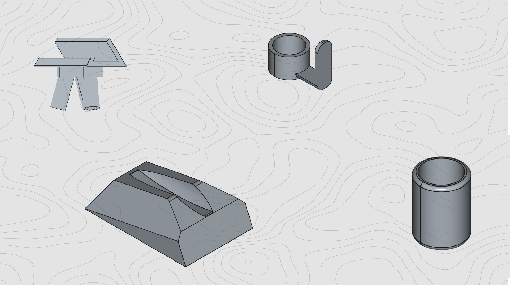
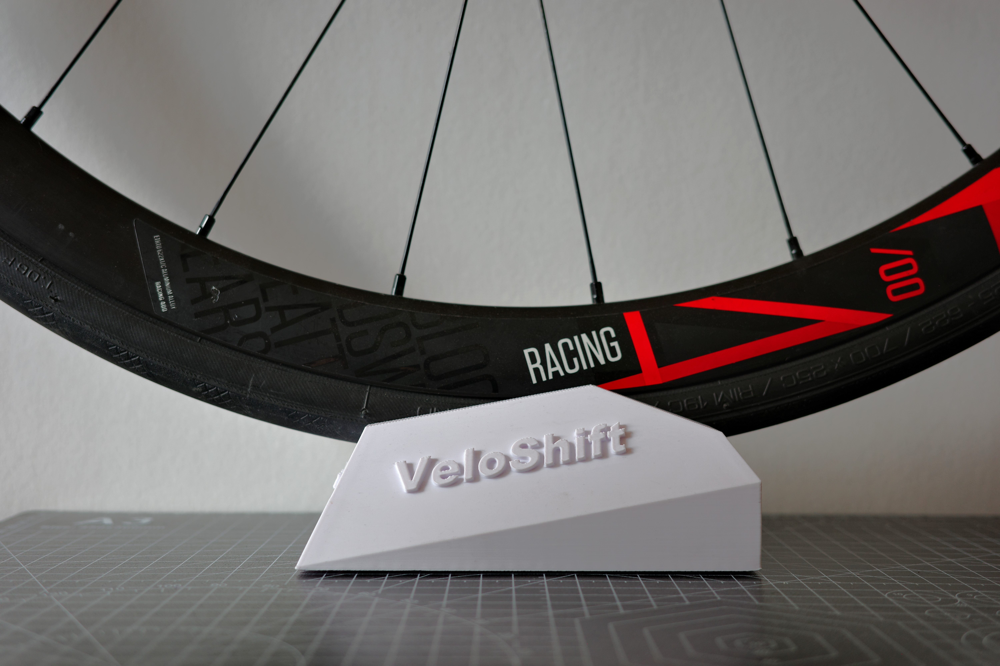
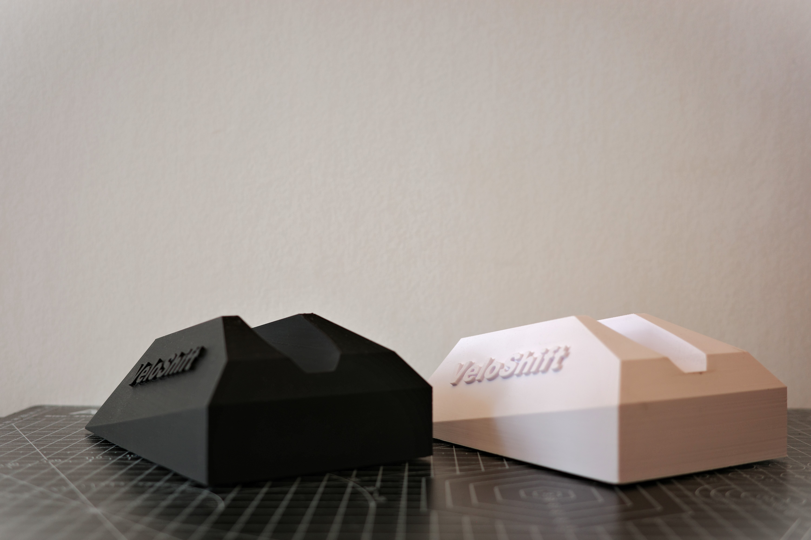

# VeloShift : 3D Printable Cycling Accessories

Free STL files for indoor cycling. Download, print, ride.

---

## Downloads

| Item | Files | Supports? | Material |
|------|-------|-----------|----------|
| [Wheel Block (30mm)](#wheel-block-30mm) | [`wheelblock30mm_veloshift/`](wheelblock30mm_veloshift/) | No | PLA+ / PETG |
| [Tablet Stand](#tablet-stand) | [`tabletstand_veloshift/`](tabletstand_veloshift/) | Yes | PLA+ / PETG |
| [AirTag Holder](#airtag-holder) | [`airtag_veloshift/`](airtag_veloshift/) | No | PETG |

All prints: **0.2mm layer height · 0.4mm nozzle · 15–25% infill**

---

## The Story

VeloShift started as a passion project : beautifully designed, 3D-printed topographic route maps of iconic [Zwift](https://www.zwift.com/) courses. The kind of thing you'd frame and hang in your pain cave.

Everything was designed, prototyped, and ready to go. Then Zwift said no : their brand and route data couldn't be used commercially. Without that, the core product couldn't move forward.

Rather than let all the work disappear, everything is published here for free.

---

## Wheel Block (30mm)

A front wheel block to stabilize your bike on an indoor trainer. VeloShift logo embossed on the front. Single-piece print, no supports needed.

  
  

📁 [`wheelblock30mm_veloshift/`](wheelblock30mm_veloshift/)

---

## Tablet Stand

Modular three-part tablet/iPad stand for comfortable viewing while riding. Includes a cable holder.

  
  

**Parts:**
1. `ipadstand_stand_veloshift.stl` : Main body
2. `ipadstand_feet_veloshift.stl` : Base
3. `ipadstand_cableholder_veloshift.stl` : Cable holder

⚠️ Supports required.

📁 [`tabletstand_veloshift/`](tabletstand_veloshift/)

---

## AirTag Holder

Two-part holder that mounts discreetly on a bike frame using bottle cage bolts. Snaps together around the AirTag.

  
  

**Parts:**
1. `airtagholder_part1_veloshift.stl` : Top shell
2. `airtagholder_part2_veloshift.stl` : Bottom shell

📁 [`airtag_veloshift/`](airtag_veloshift/)

---

## Design

Everything designed from scratch in [FreeCAD](https://www.freecad.org/) : fully parametric, no proprietary software needed. Iterated on a home FDM printer.

## License

Personal use only. No commercial use, redistribution, or resale without permission.
